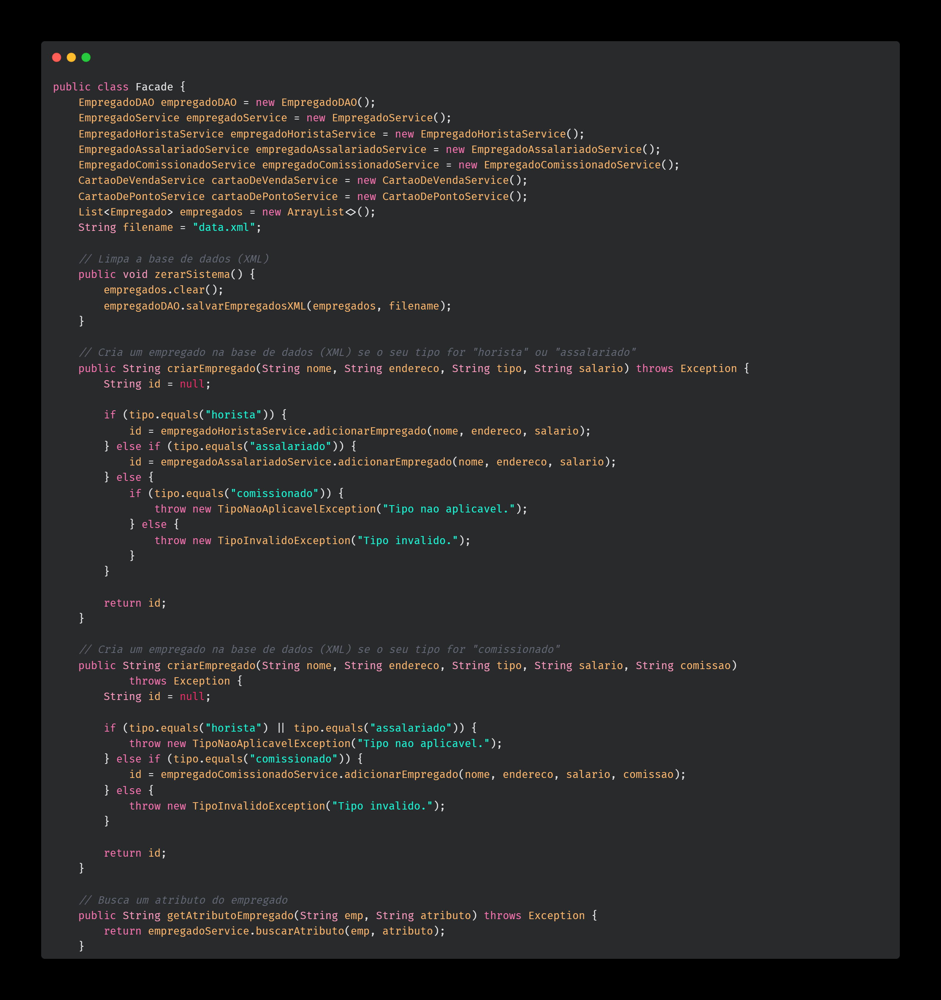
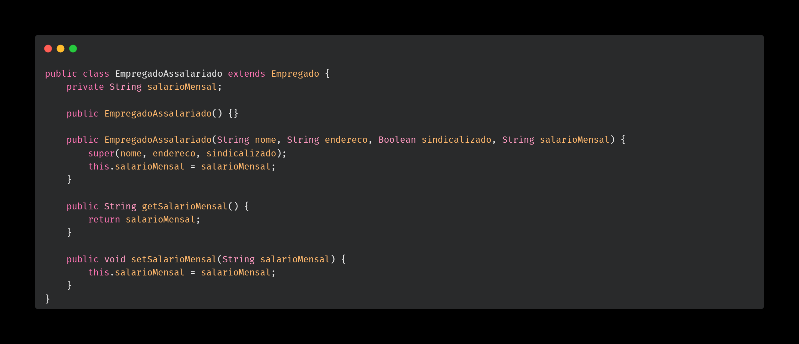
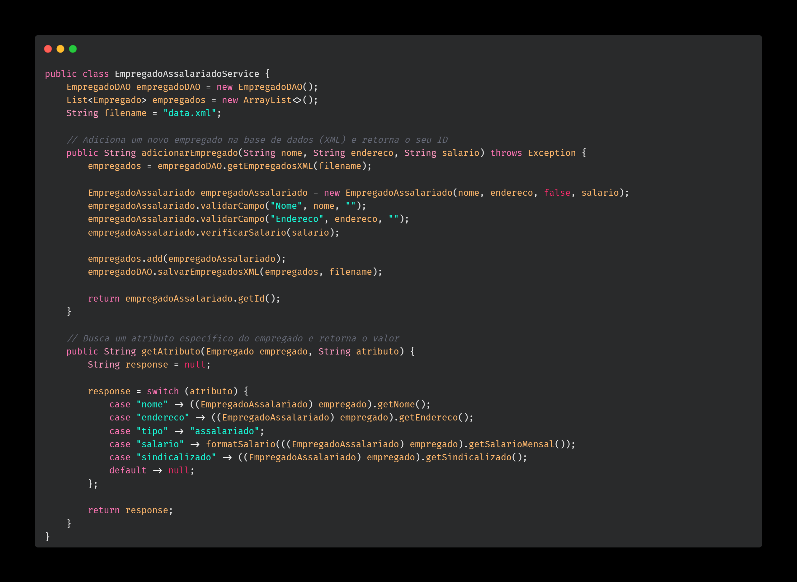
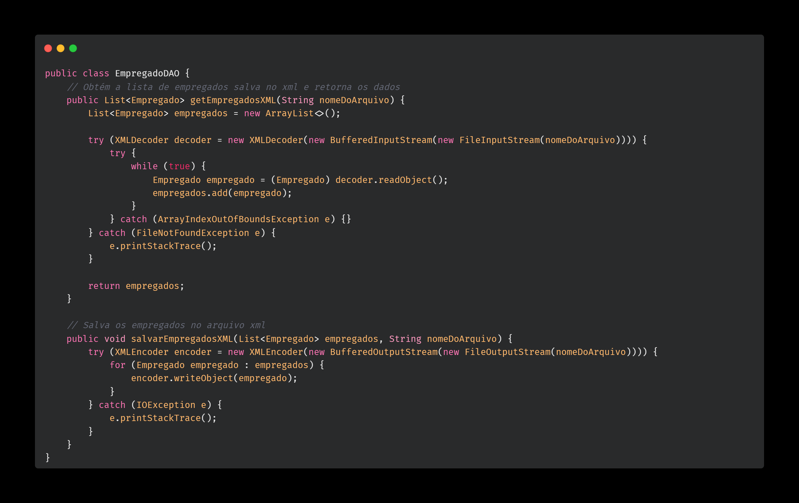

# WePayU (Relatório) - Projeto de Programação 2 (P2)

### Discente: Sallys Carlos da Silva

<h2>Informações gerais</h2>

Neste relatório, constam informações importantes sobre os padrões utilizados no desenvolvimento da aplicação, além de exemplificações.

Foram utilizados no projeto os seguintes padrões de projeto: <b>Facade</b>, <b>Camadas</b>, <b>Services</b>, <b>Models</b> e <b>DAO</b>.

<h2>Facade</h2>

O padrão de projeto "Facade" permite a simplificação da estrutura de uma aplicação, fornecendo uma interface unificada para um conjunto de interfaces em um subsistema. Ele foi desenvolvido com o intuito de ocultar a complexidade existentes nas classes internas do sistema, funcionando como uma camada de abstração.

<h4>Vantagens:</h4>
<ul>
    <li>
        Simplicidade: o seu conjunto de interfaces reduz a complexidade do sistema, mantendo um padrão muito bem definido.
    </li>
    <li>
        Abstração: o processo de modificação ou substituição dos subsistemas se torna mais fácil, pois as mudanças são encapsuladas pelo Facade, sem afetar diretamente o código principal.
    </li>
</ul>

<h4>Desvantagens:</h4>
<ul>
    <li>
        Complexidade: o facade, com toda sua abstração, pode ocultar funcionalidades essenciais do subsistema.
    </li>
    <li>
        Flexibilidade limitada: o facade pode desabilitar o acesso a funcionalidades internas que os subsistemas necessitam acessar diretamente.
    </li>
</ul>

<h4>Exemplo de uso:</h4>

<h2>Camadas</h2>

Esse padrão consiste na separação das funcionalidades do sistema em camadas distintas, com responsabilidades únicas e definidas. Esse padrão permite uma modularização do sistema e o encapsulamento dos dados, além de facilitar a organização das regras de negócio.

<h2>Models</h2>

Os "models" são responsáveis por organizar e estruturar os modelos de dados da aplicação. Os "models" representam as entidades do sistema e frequentemente incluem lógica relacionada à manipulação e validação dos dados.

<h4>Exemplo de uso:</h4>

<h4>Vantagens:</h4>
<ul>
    <li>
        Separação de responsabilidades: o model ajuda a diminuir a complexidade do sistema, pois mantém a modelagem dos dados separada da lógica de negócio de cada entidade do sistema.
    </li>
    <li>
        Manutenibilidade: com a separação da lógica de negócio de cada parte do sistema, há uma melhor organização de código, tornando-o mais fácil de manter.
    </li>
</ul>

<h2>Service</h2>

 Os "services" são módulos (classes) que contém a lógica de negócios da aplicação. Eles são responsáveis por coordenar as operações entre os "models", executando lógica de negócios e orquestrando a interação entre diferentes partes da aplicação. Está intrinsecamente relacionado ao padrão em camadas.

<h4>Exemplo de uso:</h4>

<h4>Vantagens:</h4>
<ul>
    <li>
        Encapsulamento: o service ajuda a manter a lógica de negócio separada das demais partes do sistema.
    </li>
    <li>
        Testabilidade: com a lógica de negócio isolada das demais camadas, fica mais fácil reunir os testes específicos para cada regra de negócio.
    </li>
</ul>

<h2>DAO</h2>

O Data Access Object (DAO) é responsável por separar a lógica de negócio do acesso aos dados da aplicação. Esse padrão permite um melhor encapsulamento do acesso aos dados, além de facilitar aspectos como testabilidade, flexibilização e reutilização de código.

<h4>Exemplo de uso:</h4>

<h4>Vantagem:</h4>
<ul>
    <li>
        Abstração: o DAO proporciona uma camada de abstração entre a lógica de negócios e o acesso aos dados. Ou seja, permite que detalhes específicos da base de dados estejam desconectados do código principal da aplicação (regras de negócio).
    </li>
</ul>